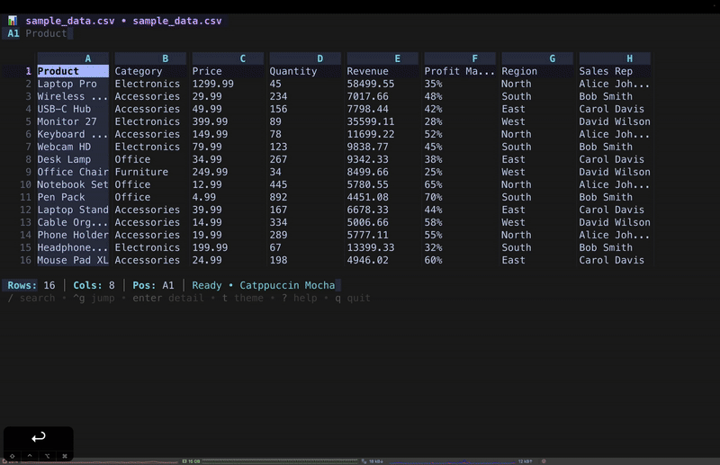

<<<<<<< HEAD
# vexcel
=======
# 📊 Vex - Excel Viewer

A beautiful, fast, and feature-rich terminal-based Excel and CSV viewer built with Go.

[](https://golang.org/)
[](LICENSE)
[](https://github.com/CodeOne45/vex-tui/releases)




## ✨ Features

### 🎨 Six Beautiful Themes

- **Catppuccin Mocha** - Soft pastels, perfect for all-day use
- **Nord** - Cool Arctic blues, minimal and focused
- **Rosé Pine** - Elegant rose tones, sophisticated
- **Tokyo Night** - Vibrant cyberpunk aesthetic
- **Gruvbox** - Warm retro colors, comfortable
- **Dracula** - Classic high contrast theme

### 🔍 Powerful Navigation

- Vim-style keybindings (hjkl) and arrow keys
- Jump to any cell (Ctrl+G) with multiple format support
- Page Up/Down, Home/End
- Search across all cells and formulas (/)
- Navigate search results (n/N)

### 📋 Data Operations

- Copy cell (c) or entire row (C)
- Export to CSV or JSON
- Toggle formula display (f)
- View detailed cell information (Enter)

### 📊 Live Data Visualization

- Bar charts
- Line charts
- Sparklines
- Pie charts

### 📑 File Support

- Excel files (.xlsx, .xlsm, .xls)
- CSV files
- Multiple sheets with Tab navigation
- Formula display and evaluation
- Large file optimization with lazy loading

## 🚀 Installation

### Using go install

```bash
go install github.com/CodeOne45/vexcel@latest
```

### Build from Source

```bash
# Clone the repository
git clone https://github.com/dth99/vexcel.git
cd vex-tui

# Install dependencies
go mod download

# Build
go build -o vex .

# Optional: Install globally
go install
```

### Download Binary

Download pre-built binaries from the [releases page](https://github.com/vex/releases).

## 📖 Usage

```bash
# Basic usage
vex data.xlsx

# With a specific theme
vex report.csv --theme nord

# Short flag
vex sales.xlsx -t tokyo-night
```

## ⌨️ Keyboard Shortcuts

### Navigation

- `↑↓←→` or `hjkl` - Navigate cells
- `Page Up/Down` - Scroll by page
- `Ctrl+U/D` - Alternative page scroll
- `Home/End` or `0/$` - First/last column
- `g/G` - First/last column
- `Tab/Shift+Tab` - Next/previous sheet

### Search & Actions

- `/` - Search (vim-style)
- `n/N` - Next/previous result
- `Ctrl+G` - Jump to cell
- `Enter` - View cell details
- `c` - Copy cell
- `C` - Copy entire row
- `f` - Toggle formula display
- `e` - Export sheet
- `t` - Theme selector
- `?` - Toggle help
- `q` or `Ctrl+C` - Quit

### Data Visualization

Step 1: Select Data Range

1. Navigate to your data
2. Press 'V' (shift+v) to start selection
3. Move cursor to select range (arrows/hjkl)
4. Press 'V' again to finish selection

Step 2: Visualize

1. Press 'v' (lowercase) to open visualization
2. Press 1-4 to switch between chart types:
   - 1: Bar Chart
   - 2: Line Chart
   - 3: Sparkline
   - 4: Pie Chart
3. Press Esc to close

## 🏗️ Project Structure

```
vex-tui/
├── main.go                 # Application entry point
├── internal/
│   ├── app/               # Application logic
│   │   ├── model.go       # State management
│   │   ├── update.go      # Event handling
│   │   ├── view.go        # Rendering logic
│   │   └── keys.go        # Keybindings
│   ├── loader/            # File I/O operations
│   │   └── loader.go
│   ├── theme/             # Theme management
│   │   └── theme.go
│   └── ui/                # UI utilities
│       └── ui.go
└── pkg/
    └── models/            # Data models
        └── models.go
```

## 🤝 Contributing

Contributions are welcome! Please feel free to submit a Pull Request. For major changes, please open an issue first to discuss what you would like to change.

### Development Setup

```bash
# Clone the repository
git clone https://github.com/dth99/vexcel.git
cd vex

# Install dependencies
go mod download

# Run tests
go test ./...

# Build
go build -o vex .
```

### Code Style

This project follows standard Go conventions:

- Run `go fmt` before committing
- Follow [Effective Go](https://golang.org/doc/effective_go.html) guidelines
- Write clear commit messages

## 📄 License

This project is licensed under the MIT License - see the [LICENSE](LICENSE) file for details.

## 🙏 Acknowledgments

- Built with the amazing [Charm](https://charm.sh/) ecosystem
  - [Bubble Tea](https://github.com/charmbracelet/bubbletea) - TUI framework
  - [Lipgloss](https://github.com/charmbracelet/lipgloss) - Terminal styling
  - [Bubbles](https://github.com/charmbracelet/bubbles) - TUI components
- Excel parsing by [Excelize](https://github.com/xuri/excelize)
- Clipboard support by [clipboard](https://github.com/atotto/clipboard)
- Themes inspired by [Catppuccin](https://github.com/catppuccin/catppuccin), [Nord](https://www.nordtheme.com/), [Rosé Pine](https://rosepinetheme.com/), [Tokyo Night](https://github.com/enkia/tokyo-night-vscode-theme), [Gruvbox](https://github.com/morhetz/gruvbox), and [Dracula](https://draculatheme.com/)

## 🔒 Security

If you discover a security vulnerability, please send an email to [deep99.official@gmail.com](mailto:deep99.official@gmail.com). All security vulnerabilities will be promptly addressed.

## 📮 Contact

- GitHub: [@vex-tui](https://github.com/dth99/vexcel.git)
- Issues: [GitHub Issues](https://github.com/dth99/vexcel.git/issues)

---

Made with ❤️ for terminal enthusiasts everywhere.
>>>>>>> 1946f08 (v1 testing)
